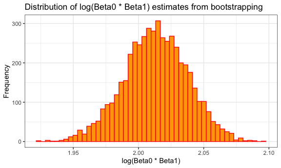

p8105_hw6_RYW2109
================
Rita Wang
2024-12-02

    ## 'data.frame':    5000 obs. of  2 variables:
    ##  $ r_squared       : num  0.923 0.902 0.908 0.913 0.917 ...
    ##  $ log_beta_product: num  1.98 1.97 2.01 2.04 2.03 ...


The R-squared distribution has a normal distribution, which also
represents the percentage of variance in tmax that is explained by tmin.
The log(Beta0 \* Beta1) distribution also has a relative normal
distribution. Beta0 represents the intercept of the regression model
with Beta1 representing the slope; the product of these two values in
the distribution provides an idea of the uncertainty of the interaction
between the intercept and slope.

    ## [1] "95% CI for R-squared:"

    ##      2.5%     97.5% 
    ## 0.8937119 0.9273558

    ## [1] "95% CI for log(Beta0 * Beta1):"

    ##     2.5%    97.5% 
    ## 1.963380 2.060238

    ## # A tibble: 4 × 7
    ##   term             estimate std.error statistic  p.value conf.low conf.high
    ##   <chr>               <dbl>     <dbl>     <dbl>    <dbl>    <dbl>     <dbl>
    ## 1 (Intercept)       0.664     0.174        3.80 1.42e- 4   0.325    1.01   
    ## 2 victim_age       -0.00520   0.00325     -1.60 1.10e- 1  -0.0116   0.00115
    ## 3 victim_sexMale   -1.04      0.143       -7.26 3.74e-13  -1.32    -0.759  
    ## 4 victim_raceWhite  0.900     0.180        4.99 6.04e- 7   0.550    1.26

    ## # A tibble: 1 × 3
    ##   estimate conf.low conf.high
    ##      <dbl>    <dbl>     <dbl>
    ## 1    -1.04    -1.32    -0.759

    ## # A tibble: 5 × 7
    ##   term              estimate std.error statistic p.value  conf.low conf.high
    ##   <chr>                <dbl>     <dbl>     <dbl>   <dbl>     <dbl>     <dbl>
    ## 1 (Intercept)         2.13      0.824     2.59   0.00961    0.605    3.86   
    ## 2 victim_age         -0.0137    0.0110   -1.24   0.213     -0.0356   0.00788
    ## 3 victim_sexMale     -0.844     0.546    -1.55   0.122     -2.02     0.152  
    ## 4 victim_sexUnknown  12.9     883.        0.0146 0.988   -167.      NA      
    ## 5 victim_raceWhite    0.503     0.448     1.12   0.261     -0.403    1.37   
    ## # A tibble: 4 × 7
    ##   term             estimate std.error statistic  p.value conf.low conf.high
    ##   <chr>               <dbl>     <dbl>     <dbl>    <dbl>    <dbl>     <dbl>
    ## 1 (Intercept)        1.72     0.278       6.18  6.22e-10   1.19     2.28   
    ## 2 victim_age        -0.0114   0.00489    -2.32  2.03e- 2  -0.0210  -0.00175
    ## 3 victim_sexMale    -0.669    0.227      -2.95  3.22e- 3  -1.13    -0.237  
    ## 4 victim_raceWhite   0.207    0.302       0.686 4.93e- 1  -0.368    0.823  
    ## # A tibble: 4 × 7
    ##   term             estimate std.error statistic  p.value conf.low conf.high
    ##   <chr>               <dbl>     <dbl>     <dbl>    <dbl>    <dbl>     <dbl>
    ## 1 (Intercept)       0.664     0.174        3.80 1.42e- 4   0.325    1.01   
    ## 2 victim_age       -0.00520   0.00325     -1.60 1.10e- 1  -0.0116   0.00115
    ## 3 victim_sexMale   -1.04      0.143       -7.26 3.74e-13  -1.32    -0.759  
    ## 4 victim_raceWhite  0.900     0.180        4.99 6.04e- 7   0.550    1.26   
    ## # A tibble: 4 × 7
    ##   term             estimate std.error statistic  p.value conf.low conf.high
    ##   <chr>               <dbl>     <dbl>     <dbl>    <dbl>    <dbl>     <dbl>
    ## 1 (Intercept)       1.46      0.392       3.72  0.000202   0.715    2.26   
    ## 2 victim_age       -0.00750   0.00793    -0.946 0.344     -0.0231   0.00809
    ## 3 victim_sexMale   -1.14      0.333      -3.44  0.000587  -1.83    -0.518  
    ## 4 victim_raceWhite  0.894     0.435       2.06  0.0395     0.0813   1.81   
    ## # A tibble: 4 × 7
    ##   term             estimate std.error statistic   p.value conf.low conf.high
    ##   <chr>               <dbl>     <dbl>     <dbl>     <dbl>    <dbl>     <dbl>
    ## 1 (Intercept)       1.20      0.280       4.28  0.0000183   0.661    1.76   
    ## 2 victim_age       -0.00761   0.00519    -1.47  0.142      -0.0178   0.00258
    ## 3 victim_sexMale   -0.351     0.229      -1.53  0.125      -0.812    0.0882 
    ## 4 victim_raceWhite -0.0570    0.277      -0.205 0.837      -0.593    0.499  
    ## # A tibble: 5 × 7
    ##   term              estimate std.error statistic     p.value conf.low conf.high
    ##   <chr>                <dbl>     <dbl>     <dbl>       <dbl>    <dbl>     <dbl>
    ## 1 (Intercept)        0.150     0.410       0.365 0.715        -0.653     0.961 
    ## 2 victim_age        -0.00451   0.00904    -0.499 0.618        -0.0224    0.0131
    ## 3 victim_sexMale    -0.395     0.326      -1.21  0.226        -1.04      0.244 
    ## 4 victim_sexUnknown -1.53      1.15       -1.33  0.184        -3.95      0.651 
    ## 5 victim_raceWhite   2.49      0.468       5.32  0.000000106   1.65      3.51  
    ## # A tibble: 4 × 7
    ##   term             estimate std.error statistic  p.value conf.low conf.high
    ##   <chr>               <dbl>     <dbl>     <dbl>    <dbl>    <dbl>     <dbl>
    ## 1 (Intercept)       -0.437    0.373       -1.17 0.242    -1.17       0.298 
    ## 2 victim_age         0.0187   0.00745      2.51 0.0121    0.00420    0.0335
    ## 3 victim_sexMale    -0.825    0.305       -2.71 0.00678  -1.43      -0.231 
    ## 4 victim_raceWhite   1.13     0.323        3.50 0.000467  0.509      1.78  
    ## # A tibble: 4 × 7
    ##   term              estimate std.error statistic      p.value conf.low conf.high
    ##   <chr>                <dbl>     <dbl>     <dbl>        <dbl>    <dbl>     <dbl>
    ## 1 (Intercept)       2.33       0.422      5.52   0.0000000331   1.54      3.21  
    ## 2 victim_age       -0.000304   0.00776   -0.0392 0.969         -0.0154    0.0151
    ## 3 victim_sexMale   -1.20       0.351     -3.42   0.000616      -1.95     -0.559 
    ## 4 victim_raceWhite  0.735      0.365      2.01   0.0441         0.0600    1.51  
    ## # A tibble: 4 × 7
    ##   term             estimate std.error statistic  p.value conf.low conf.high
    ##   <chr>               <dbl>     <dbl>     <dbl>    <dbl>    <dbl>     <dbl>
    ## 1 (Intercept)      -0.0776    0.121      -0.640 5.22e- 1 -0.315      0.160 
    ## 2 victim_age        0.00646   0.00248     2.60  9.19e- 3  0.00159    0.0113
    ## 3 victim_sexMale   -0.939     0.101      -9.34  9.40e-21 -1.14      -0.743 
    ## 4 victim_raceWhite  0.599     0.134       4.47  7.90e- 6  0.336      0.862 
    ## # A tibble: 4 × 7
    ##   term             estimate std.error statistic     p.value conf.low conf.high
    ##   <chr>               <dbl>     <dbl>     <dbl>       <dbl>    <dbl>     <dbl>
    ## 1 (Intercept)       2.04      0.387        5.26 0.000000145   1.32     2.85   
    ## 2 victim_age       -0.00688   0.00627     -1.10 0.273        -0.0192   0.00545
    ## 3 victim_sexMale   -1.58      0.350       -4.53 0.00000598   -2.33    -0.942  
    ## 4 victim_raceWhite  1.13      0.310        3.63 0.000279      0.545    1.77   
    ## # A tibble: 4 × 7
    ##   term             estimate std.error statistic     p.value conf.low conf.high
    ##   <chr>               <dbl>     <dbl>     <dbl>       <dbl>    <dbl>     <dbl>
    ## 1 (Intercept)       0.720     0.236        3.05 0.00231      0.263      1.19  
    ## 2 victim_age        0.00545   0.00491      1.11 0.267       -0.00415    0.0151
    ## 3 victim_sexMale   -1.02      0.195       -5.22 0.000000178 -1.41      -0.645 
    ## 4 victim_raceWhite  0.671     0.163        4.12 0.0000380    0.354      0.993 
    ## # A tibble: 4 × 7
    ##   term               estimate std.error statistic  p.value conf.low conf.high
    ##   <chr>                 <dbl>     <dbl>     <dbl>    <dbl>    <dbl>     <dbl>
    ## 1 (Intercept)       1.69        0.603     2.80    0.00510   0.575      2.97  
    ## 2 victim_age        0.0000704   0.00921   0.00764 0.994    -0.0180     0.0183
    ## 3 victim_sexMale   -1.68        0.507    -3.31    0.000934 -2.79      -0.764 
    ## 4 victim_raceWhite  0.633       0.322     1.97    0.0489    0.00816    1.27  
    ## # A tibble: 4 × 7
    ##   term             estimate std.error statistic     p.value conf.low conf.high
    ##   <chr>               <dbl>     <dbl>     <dbl>       <dbl>    <dbl>     <dbl>
    ## 1 (Intercept)      -0.00424   0.148     -0.0287 0.977       -0.294      0.286 
    ## 2 victim_age        0.00430   0.00300    1.44   0.151       -0.00158    0.0102
    ## 3 victim_sexMale   -0.594     0.118     -5.03   0.000000501 -0.826     -0.363 
    ## 4 victim_raceWhite  0.431     0.148      2.91   0.00357      0.141      0.722 
    ## # A tibble: 4 × 7
    ##   term             estimate std.error statistic p.value conf.low conf.high
    ##   <chr>               <dbl>     <dbl>     <dbl>   <dbl>    <dbl>     <dbl>
    ## 1 (Intercept)       1.61      0.496       3.24  0.00121   0.679    2.64   
    ## 2 victim_age       -0.00442   0.00985    -0.449 0.654    -0.0237   0.0152 
    ## 3 victim_sexMale   -0.798     0.433      -1.85  0.0650   -1.71     0.00680
    ## 4 victim_raceWhite  0.223     0.525       0.425 0.671    -0.766    1.33   
    ## # A tibble: 4 × 7
    ##   term             estimate std.error statistic     p.value conf.low conf.high
    ##   <chr>               <dbl>     <dbl>     <dbl>       <dbl>    <dbl>     <dbl>
    ## 1 (Intercept)       1.96      0.377      5.18   0.000000220   1.24     2.73   
    ## 2 victim_age       -0.0179    0.00680   -2.63   0.00842      -0.0315  -0.00474
    ## 3 victim_sexMale   -1.05      0.304     -3.44   0.000590     -1.67    -0.470  
    ## 4 victim_raceWhite  0.00671   0.239      0.0280 0.978        -0.461    0.480  
    ## # A tibble: 4 × 7
    ##   term             estimate std.error statistic p.value conf.low conf.high
    ##   <chr>               <dbl>     <dbl>     <dbl>   <dbl>    <dbl>     <dbl>
    ## 1 (Intercept)        0.135     0.523      0.259  0.796  -0.886      1.19  
    ## 2 victim_age         0.0131    0.0108     1.22   0.223  -0.00747    0.0349
    ## 3 victim_sexMale     0.121     0.445      0.272  0.785  -0.789      0.974 
    ## 4 victim_raceWhite   0.797     0.402      1.98   0.0477  0.0345     1.62  
    ## # A tibble: 4 × 7
    ##   term             estimate std.error statistic  p.value conf.low conf.high
    ##   <chr>               <dbl>     <dbl>     <dbl>    <dbl>    <dbl>     <dbl>
    ## 1 (Intercept)       1.13      0.170        6.64 3.15e-11   0.799    1.47   
    ## 2 victim_age       -0.00490   0.00317     -1.55 1.22e- 1  -0.0111   0.00131
    ## 3 victim_sexMale   -0.609     0.137       -4.45 8.51e- 6  -0.881   -0.345  
    ## 4 victim_raceWhite  0.303     0.127        2.39 1.67e- 2   0.0569   0.554  
    ## # A tibble: 4 × 7
    ##   term             estimate std.error statistic      p.value conf.low conf.high
    ##   <chr>               <dbl>     <dbl>     <dbl>        <dbl>    <dbl>     <dbl>
    ## 1 (Intercept)       0.997     0.216        4.62 0.00000380     0.580    1.43   
    ## 2 victim_age       -0.00651   0.00442     -1.47 0.141         -0.0152   0.00217
    ## 3 victim_sexMale   -0.567     0.172       -3.30 0.000951      -0.910   -0.236  
    ## 4 victim_raceWhite  0.904     0.158        5.72 0.0000000109   0.598    1.22   
    ## # A tibble: 4 × 7
    ##   term             estimate std.error statistic   p.value conf.low conf.high
    ##   <chr>               <dbl>     <dbl>     <dbl>     <dbl>    <dbl>     <dbl>
    ## 1 (Intercept)       0.851     0.204       4.18  0.0000291   0.456    1.26   
    ## 2 victim_age       -0.00316   0.00412    -0.765 0.444      -0.0112   0.00494
    ## 3 victim_sexMale   -0.593     0.164      -3.62  0.000289   -0.919   -0.277  
    ## 4 victim_raceWhite  0.579     0.147       3.93  0.0000861   0.292    0.871  
    ## # A tibble: 4 × 7
    ##   term             estimate std.error statistic      p.value conf.low conf.high
    ##   <chr>               <dbl>     <dbl>     <dbl>        <dbl>    <dbl>     <dbl>
    ## 1 (Intercept)       1.42      0.252       5.63  0.0000000176  0.936      1.92  
    ## 2 victim_age        0.00136   0.00461     0.295 0.768        -0.00766    0.0104
    ## 3 victim_sexMale   -1.03      0.210      -4.92  0.000000849  -1.46      -0.635 
    ## 4 victim_raceWhite  0.560     0.165       3.40  0.000682      0.238      0.885 
    ## # A tibble: 4 × 7
    ##   term             estimate std.error statistic p.value conf.low conf.high
    ##   <chr>               <dbl>     <dbl>     <dbl>   <dbl>    <dbl>     <dbl>
    ## 1 (Intercept)       2.29       0.833      2.75  0.00598   0.844     4.25  
    ## 2 victim_age        0.00456    0.0119     0.383 0.702    -0.0185    0.0286
    ## 3 victim_sexMale   -1.80       0.757     -2.38  0.0173   -3.66     -0.531 
    ## 4 victim_raceWhite  0.472      0.478      0.987 0.324    -0.435     1.46  
    ## # A tibble: 4 × 7
    ##   term             estimate std.error statistic p.value conf.low conf.high
    ##   <chr>               <dbl>     <dbl>     <dbl>   <dbl>    <dbl>     <dbl>
    ## 1 (Intercept)       0.380     0.243       1.57  0.117    -0.0936   0.859  
    ## 2 victim_age       -0.00299   0.00438    -0.684 0.494    -0.0116   0.00559
    ## 3 victim_sexMale   -0.413     0.188      -2.20  0.0279   -0.784   -0.0470 
    ## 4 victim_raceWhite  0.548     0.176       3.11  0.00184   0.205    0.895  
    ## # A tibble: 4 × 7
    ##   term             estimate std.error statistic   p.value conf.low conf.high
    ##   <chr>               <dbl>     <dbl>     <dbl>     <dbl>    <dbl>     <dbl>
    ## 1 (Intercept)       0.804     0.295        2.73 0.00638     0.235    1.39   
    ## 2 victim_age       -0.00874   0.00607     -1.44 0.150      -0.0207   0.00310
    ## 3 victim_sexMale   -0.712     0.243       -2.93 0.00337    -1.20    -0.244  
    ## 4 victim_raceWhite  0.919     0.212        4.33 0.0000148   0.509    1.34   
    ## # A tibble: 4 × 7
    ##   term             estimate std.error statistic  p.value conf.low conf.high
    ##   <chr>               <dbl>     <dbl>     <dbl>    <dbl>    <dbl>     <dbl>
    ## 1 (Intercept)        1.91     0.216        8.84 9.37e-19   1.50     2.35   
    ## 2 victim_age        -0.0124   0.00409     -3.03 2.46e- 3  -0.0204  -0.00436
    ## 3 victim_sexMale    -0.722    0.180       -4.01 6.15e- 5  -1.09    -0.378  
    ## 4 victim_raceWhite   0.542    0.230        2.35 1.85e- 2   0.104    1.01   
    ## # A tibble: 4 × 7
    ##   term             estimate std.error statistic  p.value conf.low conf.high
    ##   <chr>               <dbl>     <dbl>     <dbl>    <dbl>    <dbl>     <dbl>
    ## 1 (Intercept)       0.284     0.345       0.824 0.410     -0.386     0.970 
    ## 2 victim_age        0.00223   0.00666     0.335 0.738     -0.0109    0.0153
    ## 3 victim_sexMale   -1.03      0.279      -3.68  0.000230  -1.59     -0.490 
    ## 4 victim_raceWhite  0.762     0.222       3.43  0.000613   0.328     1.20  
    ## # A tibble: 4 × 7
    ##   term             estimate std.error statistic       p.value conf.low conf.high
    ##   <chr>               <dbl>     <dbl>     <dbl>         <dbl>    <dbl>     <dbl>
    ## 1 (Intercept)        1.48     0.250        5.90 0.00000000368   0.997    1.98   
    ## 2 victim_age        -0.0108   0.00492     -2.20 0.0280         -0.0205  -0.00117
    ## 3 victim_sexMale    -0.641    0.212       -3.03 0.00246        -1.07    -0.237  
    ## 4 victim_raceWhite   0.877    0.261        3.36 0.000780        0.384    1.41   
    ## # A tibble: 4 × 7
    ##   term             estimate std.error statistic p.value conf.low conf.high
    ##   <chr>               <dbl>     <dbl>     <dbl>   <dbl>    <dbl>     <dbl>
    ## 1 (Intercept)       -0.143    0.428      -0.334   0.739 -0.986      0.702 
    ## 2 victim_age         0.0111   0.00825     1.35    0.177 -0.00487    0.0276
    ## 3 victim_sexMale     0.0726   0.353       0.206   0.837 -0.629      0.762 
    ## 4 victim_raceWhite   0.287    0.333       0.861   0.389 -0.358      0.955 
    ## # A tibble: 4 × 7
    ##   term             estimate std.error statistic  p.value conf.low conf.high
    ##   <chr>               <dbl>     <dbl>     <dbl>    <dbl>    <dbl>     <dbl>
    ## 1 (Intercept)       1.08      0.282       3.82  0.000135  0.535      1.64  
    ## 2 victim_age        0.00312   0.00551     0.566 0.571    -0.00763    0.0140
    ## 3 victim_sexMale   -0.382     0.240      -1.59  0.111    -0.869      0.0749
    ## 4 victim_raceWhite  0.157     0.176       0.895 0.371    -0.185      0.505 
    ## # A tibble: 4 × 7
    ##   term             estimate std.error statistic     p.value conf.low conf.high
    ##   <chr>               <dbl>     <dbl>     <dbl>       <dbl>    <dbl>     <dbl>
    ## 1 (Intercept)        0.806    0.211        3.81 0.000138      0.396    1.23   
    ## 2 victim_age        -0.0156   0.00472     -3.31 0.000920     -0.0250  -0.00648
    ## 3 victim_sexMale    -0.880    0.168       -5.25 0.000000155  -1.21    -0.554  
    ## 4 victim_raceWhite   0.830    0.238        3.49 0.000480      0.367    1.30   
    ## # A tibble: 4 × 7
    ##   term             estimate std.error statistic    p.value conf.low conf.high
    ##   <chr>               <dbl>     <dbl>     <dbl>      <dbl>    <dbl>     <dbl>
    ## 1 (Intercept)        1.50     0.450        3.34 0.000843    0.667      2.45  
    ## 2 victim_age         0.0111   0.00767      1.45 0.148      -0.00380    0.0263
    ## 3 victim_sexMale    -1.82     0.395       -4.62 0.00000381 -2.67      -1.10  
    ## 4 victim_raceWhite   1.23     0.399        3.09 0.00198     0.492      2.07  
    ## # A tibble: 4 × 7
    ##   term             estimate std.error statistic    p.value conf.low conf.high
    ##   <chr>               <dbl>     <dbl>     <dbl>      <dbl>    <dbl>     <dbl>
    ## 1 (Intercept)       0.115     0.274       0.418 0.676       -0.421     0.655 
    ## 2 victim_age        0.00113   0.00594     0.191 0.849       -0.0106    0.0128
    ## 3 victim_sexMale   -0.574     0.221      -2.60  0.00937     -1.01     -0.143 
    ## 4 victim_raceWhite  1.71      0.367       4.66  0.00000319   1.03      2.48  
    ## # A tibble: 4 × 7
    ##   term             estimate std.error statistic p.value conf.low conf.high
    ##   <chr>               <dbl>     <dbl>     <dbl>   <dbl>    <dbl>     <dbl>
    ## 1 (Intercept)       0.224     0.278       0.806  0.420   -0.320    0.774  
    ## 2 victim_age       -0.00364   0.00597    -0.609  0.542   -0.0154   0.00806
    ## 3 victim_sexMale   -0.0956    0.229      -0.417  0.677   -0.548    0.352  
    ## 4 victim_raceWhite  0.441     0.199       2.22   0.0264   0.0535   0.833  
    ## # A tibble: 4 × 7
    ##   term             estimate std.error statistic  p.value conf.low conf.high
    ##   <chr>               <dbl>     <dbl>     <dbl>    <dbl>    <dbl>     <dbl>
    ## 1 (Intercept)       0.422     0.408       1.03  3.01e- 1 -0.368      1.24  
    ## 2 victim_age        0.00818   0.00880     0.929 3.53e- 1 -0.00904    0.0256
    ## 3 victim_sexMale   -1.03      0.335      -3.07  2.15e- 3 -1.71      -0.389 
    ## 4 victim_raceWhite  2.01      0.319       6.29  3.23e-10  1.41       2.67  
    ## # A tibble: 4 × 7
    ##   term             estimate std.error statistic  p.value conf.low conf.high
    ##   <chr>               <dbl>     <dbl>     <dbl>    <dbl>    <dbl>     <dbl>
    ## 1 (Intercept)       1.19      0.190        6.28 3.40e-10  0.826     1.57   
    ## 2 victim_age        0.00330   0.00320      1.03 3.03e- 1 -0.00296   0.00961
    ## 3 victim_sexMale   -1.13      0.159       -7.07 1.50e-12 -1.45     -0.822  
    ## 4 victim_raceWhite  0.770     0.160        4.82 1.42e- 6  0.463     1.09   
    ## # A tibble: 5 × 7
    ##   term              estimate std.error statistic    p.value  conf.low conf.high
    ##   <chr>                <dbl>     <dbl>     <dbl>      <dbl>     <dbl>     <dbl>
    ## 1 (Intercept)        0.283     0.293      0.967  0.334       -0.286      0.864 
    ## 2 victim_age         0.00482   0.00630    0.765  0.444       -0.00752    0.0172
    ## 3 victim_sexMale    -0.842     0.248     -3.40   0.000672    -1.34      -0.363 
    ## 4 victim_sexUnknown 13.3     535.         0.0248 0.980      -95.8       NA     
    ## 5 victim_raceWhite   1.28      0.287      4.45   0.00000854   0.730      1.86  
    ## # A tibble: 4 × 7
    ##   term             estimate std.error statistic   p.value conf.low conf.high
    ##   <chr>               <dbl>     <dbl>     <dbl>     <dbl>    <dbl>     <dbl>
    ## 1 (Intercept)        2.57      0.583       4.40 0.0000107   1.49    3.79    
    ## 2 victim_age        -0.0219    0.0110     -1.98 0.0472     -0.0437 -0.000173
    ## 3 victim_sexMale    -0.777     0.466      -1.67 0.0956     -1.79    0.0699  
    ## 4 victim_raceWhite   0.724     0.572       1.27 0.205      -0.300   2.00    
    ## # A tibble: 5 × 7
    ##   term              estimate std.error statistic p.value conf.low conf.high
    ##   <chr>                <dbl>     <dbl>     <dbl>   <dbl>    <dbl>     <dbl>
    ## 1 (Intercept)         1.21      0.514     2.36    0.0185  0.246      2.28  
    ## 2 victim_age          0.0146    0.0100    1.46    0.145  -0.00466    0.0347
    ## 3 victim_sexMale     -1.09      0.440    -2.47    0.0135 -2.03      -0.279 
    ## 4 victim_sexUnknown -16.1     883.       -0.0183  0.985  NA        164.    
    ## 5 victim_raceWhite    0.228     0.335     0.681   0.496  -0.420      0.897 
    ## # A tibble: 4 × 7
    ##   term             estimate std.error statistic  p.value conf.low conf.high
    ##   <chr>               <dbl>     <dbl>     <dbl>    <dbl>    <dbl>     <dbl>
    ## 1 (Intercept)       1.85      0.499        3.70 0.000212   0.909    2.88   
    ## 2 victim_age       -0.00900   0.00857     -1.05 0.294     -0.0258   0.00800
    ## 3 victim_sexMale   -1.25      0.393       -3.17 0.00152   -2.07    -0.519  
    ## 4 victim_raceWhite  1.01      0.294        3.44 0.000588   0.447    1.60   
    ## # A tibble: 4 × 7
    ##   term             estimate std.error statistic p.value  conf.low conf.high
    ##   <chr>               <dbl>     <dbl>     <dbl>   <dbl>     <dbl>     <dbl>
    ## 1 (Intercept)       -0.485     0.743     -0.653  0.514  -1.93        1.02  
    ## 2 victim_age         0.0272    0.0137     1.99   0.0469  0.000645    0.0547
    ## 3 victim_sexMale    -0.966     0.582     -1.66   0.0971 -2.19        0.139 
    ## 4 victim_raceWhite   0.501     0.458      1.09   0.274  -0.395       1.41  
    ## # A tibble: 4 × 7
    ##   term             estimate std.error statistic  p.value conf.low conf.high
    ##   <chr>               <dbl>     <dbl>     <dbl>    <dbl>    <dbl>     <dbl>
    ## 1 (Intercept)       2.26      0.645       3.50  0.000465   1.09      3.66  
    ## 2 victim_age       -0.00820   0.00950    -0.863 0.388     -0.0270    0.0104
    ## 3 victim_sexMale   -1.64      0.550      -2.99  0.00283   -2.88     -0.672 
    ## 4 victim_raceWhite  1.35      0.349       3.88  0.000103   0.691     2.06  
    ## # A tibble: 4 × 7
    ##   term             estimate std.error statistic  p.value conf.low conf.high
    ##   <chr>               <dbl>     <dbl>     <dbl>    <dbl>    <dbl>     <dbl>
    ## 1 (Intercept)       -0.723    0.416       -1.74 0.0818    -1.54      0.0951
    ## 2 victim_age         0.0269   0.00745      3.61 0.000305   0.0125    0.0418
    ## 3 victim_sexMale    -0.498    0.332       -1.50 0.134     -1.17      0.144 
    ## 4 victim_raceWhite   0.866    0.248        3.49 0.000475   0.385     1.36  
    ## # A tibble: 4 × 7
    ##   term              estimate std.error statistic p.value conf.low conf.high
    ##   <chr>                <dbl>     <dbl>     <dbl>   <dbl>    <dbl>     <dbl>
    ## 1 (Intercept)       0.680      0.466      1.46     0.144  -0.219     1.62  
    ## 2 victim_age       -0.000705   0.00965   -0.0731   0.942  -0.0197    0.0184
    ## 3 victim_sexMale   -0.615      0.387     -1.59     0.112  -1.40      0.127 
    ## 4 victim_raceWhite  0.511      0.399      1.28     0.201  -0.260     1.32  
    ## # A tibble: 4 × 7
    ##   term             estimate std.error statistic   p.value conf.low conf.high
    ##   <chr>               <dbl>     <dbl>     <dbl>     <dbl>    <dbl>     <dbl>
    ## 1 (Intercept)       0.545     0.190        2.88 0.00404     0.176    0.920  
    ## 2 victim_age       -0.00621   0.00413     -1.50 0.133      -0.0143   0.00186
    ## 3 victim_sexMale   -0.573     0.147       -3.90 0.0000950  -0.862   -0.287  
    ## 4 victim_raceWhite  0.732     0.185        3.96 0.0000761   0.374    1.10   
    ## # A tibble: 4 × 7
    ##   term             estimate std.error statistic p.value conf.low conf.high
    ##   <chr>               <dbl>     <dbl>     <dbl>   <dbl>    <dbl>     <dbl>
    ## 1 (Intercept)      -0.516     0.477      -1.08  0.280    -1.47      0.414 
    ## 2 victim_age        0.00613   0.00937     0.654 0.513    -0.0122    0.0248
    ## 3 victim_sexMale    0.0531    0.400       0.133 0.894    -0.733     0.847 
    ## 4 victim_raceWhite  1.06      0.380       2.80  0.00510   0.335     1.83  
    ## # A tibble: 4 × 7
    ##   term             estimate std.error statistic p.value conf.low conf.high
    ##   <chr>               <dbl>     <dbl>     <dbl>   <dbl>    <dbl>     <dbl>
    ## 1 (Intercept)       0.796     0.551       1.44    0.149  -0.260     1.92  
    ## 2 victim_age        0.00320   0.00996     0.321   0.748  -0.0163    0.0230
    ## 3 victim_sexMale   -0.596     0.457      -1.30    0.193  -1.54      0.271 
    ## 4 victim_raceWhite -0.110     0.363      -0.303   0.762  -0.821     0.608 
    ## # A tibble: 4 × 7
    ##   term             estimate std.error statistic   p.value conf.low conf.high
    ##   <chr>               <dbl>     <dbl>     <dbl>     <dbl>    <dbl>     <dbl>
    ## 1 (Intercept)        1.58     0.360        4.40 0.0000109   0.898   2.31    
    ## 2 victim_age        -0.0134   0.00700     -1.91 0.0557     -0.0271  0.000353
    ## 3 victim_sexMale    -0.353    0.286       -1.23 0.218      -0.936   0.192   
    ## 4 victim_raceWhite   0.856    0.235        3.64 0.000274    0.403   1.33    
    ## # A tibble: 5 × 7
    ##   term              estimate std.error statistic   p.value conf.low conf.high
    ##   <chr>                <dbl>     <dbl>     <dbl>     <dbl>    <dbl>     <dbl>
    ## 1 (Intercept)        1.15      0.262       4.39  0.0000111   0.649    1.68   
    ## 2 victim_age        -0.00122   0.00456    -0.266 0.790      -0.0101   0.00777
    ## 3 victim_sexMale    -0.753     0.223      -3.38  0.000730   -1.20    -0.328  
    ## 4 victim_sexUnknown -0.422     0.427      -0.989 0.322      -1.25     0.439  
    ## 5 victim_raceWhite   1.77      0.536       3.30  0.000973    0.830    2.99


    ## [1] NaN

    ## [1] NaN

    ## [1] NaN

``` r
model1_fitted = predict(model1, newdata = cleaned)
model1_residuals = residuals(model1)

# df for plotting
model1_plot_data = tibble(
  fitted = model1_fitted,
  residuals = model1_residuals
)

# Plot residuals vs fitted values
ggplot(model1_plot_data, aes(x = fitted, y = residuals)) +
  geom_point(alpha = 0.6) +
  labs(title = "Residuals vs Fitted Values", x = "Fitted Values", y = "Residuals") +
  geom_hline(yintercept = 0, linetype = "dashed", color = "red") +
  theme_minimal()
```


