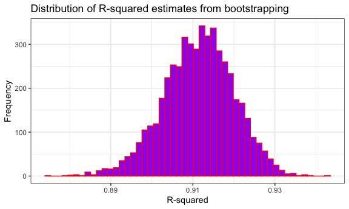

p8105_hw6_RYW2109
================
Rita Wang
2024-12-02

    ## 'data.frame':    5000 obs. of  2 variables:
    ##  $ r_squared       : num  0.912 0.901 0.921 0.9 0.909 ...
    ##  $ log_beta_product: num  2.03 2.04 1.98 2.01 2.04 ...

The R-squared distribution has a normal distribution, which also
represents the percentage of variance in tmax that is explained by tmin.
The log(Beta0 \* Beta1) distribution also has a relative normal
distribution. Beta0 represents the intercept of the regression model
with Beta1 representing the slope; the product of these two values in
the distribution provides an idea of the uncertainty of the interaction
between the intercept and slope.

    ## [1] "95% CI for R-squared:"

    ##      2.5%     97.5% 
    ## 0.8944145 0.9270440

    ## [1] "95% CI for log(Beta0 * Beta1):"

    ##     2.5%    97.5% 
    ## 1.964336 2.057961
